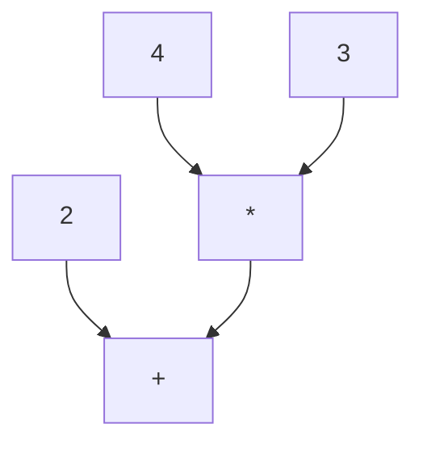
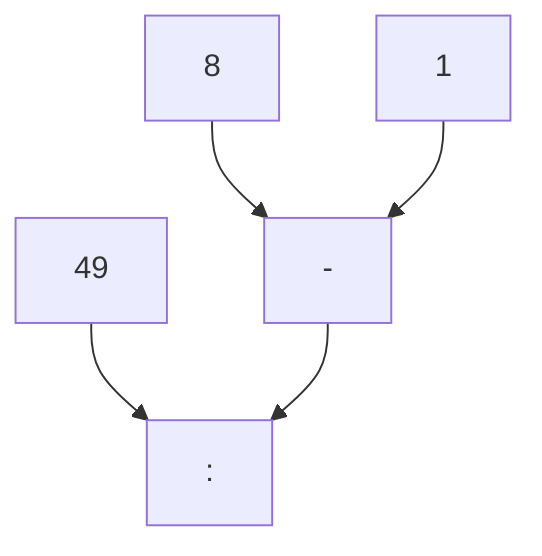

Parsing the Principia
=====================

*An introduction to coding EBNF grammars and building parsers for logical formulae.*

Introduction
------------

When editing historical text from the fields of mathematics or formal logic, there sometimes arises the question of how to represent formulae that are written in a notation that is not commonly used, anymore. The simplest approach would, of course, to represent the formulae as is and leave the work to figure out the notation to the reader - the only question being whether your typesetting system supports these formulae. 

However, readers might appreciate if the formulae are (also) presented in modern notation. And if you think of digital editions, it might ultimately be desirable to translate the historical formulae in a machine-readable format so that they can be processed by arbitrary computer systems, most notably proof assistants or computer algebra systems. 

In the following I will show how this can be done with logical formulae in the Russel-Peano notation, which enjoyed widespread use in the first half of the 20th century and was used among others by philosophers like Bertrand Russell, Rudolf Carnap or Willard van Ornam Quine. It was the notation that Russell's and Whitehead's Principia Mathematica was written in, one of the most fundamental works in mathematical logic in the early 20th century. 

This demonstration also serves as an introduction to building parsers on the basis of formal grammars - a topic well known to students of computer science, but, unfortunately not so much in the field of Digital Humanities. This is unfortunate, because formal grammars are a powerful tool that can be used for data extraction and transformation as well as for developing gentle domain specific notations that are way more comfortable to use than, say XML. 

If you have ever heard of regular expressions, as I trust most Digital Humanists have, you can think of formal grammars as the next step beyond and a more powerful version of regular expressions. So keep on reading.

Part 1: A primer on formal grammars
-----------------------------------

**Building a parser for Arithmetic Formulae**

Before we dive in the the Russell-Peano notation, which I expect only few people to know, let's start with a notation that everybody knows already from school, namely, that of simple numeric formulae like:

    2 + 4 * 3
    49 : (8 - 1)

You'll notice that we already use a computerized version of these formulae, where instead of using a centered dot for multiplication, we type an asterisk `*`. The simple reason for this is that the central dot is nowhere to be found on the keyboard. (It could be copy and pasted from a Unicode table, but that would be rather laborious if you had to do it all the time. On a computer you would usually
also type `/` instead of the colon `:`, but we'll leave the colon `:` here, for the time being.)

### Abstract syntax trees of arithmetic formulae

What we need, if we want to make the formulae machine-readable is a parser that reads those formulae and a converter that turns them into a data-structure that is directly processable by the computer and which is called the "syntax tree" of the formula. You might actually also remember this from school, though probably under a different name. In German schools this is called "Termgliederung". (Let me at this point express my gratitude to my math teacher from school, Dr. Frederich, who has taught me this and many other beautiful things about mathematics.) Now, what does the "Termgliederung" of these two formulae look like (I hope you appreciate a bit of ascii art):

    2 + 4 * 3
    |   \.  /
    |     *
    |    /
    \   /
      +

    49 : (8 - 1)
     |    \   /
     |      -
     |     /
     |    /
     \   /
       :

As you can can see, the "Termgliederung" looks like an upside down tree. In this case it is even a binary tree, but this merely reflects the contingent fact that all relations that we deal with in this trivial example, i.e. `+`, `-`, `*`, `:`, are binary relations. Generally speaking, the syntactical structure of any formula is a tree-structure that consists of "nodes" and "branches" and where every node can have an arbitrary number of "children", a "child" being a node that is directly connected via a branch to its "parent" node. (You can think of a "node" as a point where a tree branches out.)

In the above two examples `+`, `*` as well as `:` and `-` as well as all the numbers you see are "nodes". In the first example `+` is the parent of `2` and `*` is the parent of `3` and `4`. `+` is not the direct parent of `4` or `3` but in virtue of the obvious connection between the two we can speak of the `+`being the ancestor of `4` and `3` and the latter being the descendants of `+`. `+` is also the ancestor of `2`. Both the ancestor and the descendant-relation do (by convention) also encompass the children (as "direct" or "immediate descendants") and parents ("direct" or "immediate ancestors"). 

You might notice that there is a difference between `+` and `*` on the one hand side and the numbers `2`,  `4` and `3` on the other hand side. While the arithmetical signs have children, the numbers don't. In order to describe this difference which, at times, can become important, let's call those nodes that do not have children "leaf nodes" - like the leaves of a tree. You might also notice that the `+` has no parent. There can be only one node in a tree with this property and we call this node the "root" of the tree. This is all but a bit of terminology. Don't feel overwhelmed, we will repeat these terms many times over, later, and they are intuitive enough, aren't they? 

One thing that is noteworthy about the second tree is that the round brackets `(` and `)` are not really part of the tree at all. Neither do they appear as the content of a (leaf) node, nor are they connected (via a branch) to any node. The reason is that in the tree representation, the brackets are not at all needed, anymore. For, the purpose of the brackets was to tell us that we have to calculate "8 - 1" before we do the division. Now, if the formula is cast into a tree, we can tell from the structure in which order we have to calculate our formula. And this order is always from the leaves to the root. This is also the reason why we call these trees "abstract syntax tree", because we abstract from all the details that are only needed for the "serialized" representation of the formula as a sequence of characters, like delimiters, or for readability, like whitespace and, but that will come only later, comments for the human reader.

It is also possible to build a tree representation that still contains all those superfluous details like brackets or whitespace. And this is called the "concrete syntax tree". In fact, when parsing a formula, the concrete syntax tree usually is produced first and the abstract tree will be arrived at only later by simplifying the concrete syntax tree either after the parsing step or, more often, already while parsing.

As a little **exercise**, you might want to draw the abstract tree for a variant of the second formula without the round brackets. Do you see and understand the difference?

### Representations of abstract syntax trees

In the example, before, we have represented the abtract syntax trees of arithmetic graphically (if only by using ascii-art). However, when dealing with abstract syntax trees in a (software-)development context, it is very useful to also have a "serial" representation of abstract syntax trees in a text-format that is both easy to read for humans *and* machines. One important use case where becomes important to write down syntax trees in a convenient form, are test-cases. And, believe me, you'll write a lot of test cases when developing any non-trivial parser. Thus the need for simple serialized representations of syntax trees. In the following I will briefly present three different forms of representing tree structures.

The serialized tree notation that is probably most well known to digital humanists is, of course, XML. In XML a node is written as a pair of an opening tag and a closing tags both of which are demarked with angle brackets `<` `>`. The content of a node, i.e. all branches and leaves further down the tree, is written between the opening and closing tag. (Mind: not between the angle brackets, because that is the "tag name" or "node name" or "node type", all of which are synonyms, although only "tag name" is XML-terminology proper.). For example `<tag>content</tag>` is a leaf node with the string "content" as its content. The content can be other tags, a string of characters or a mixture of both ("mixed content" in XML-terminology). The latter, however, is not needed for representing syntax trees, because a node either branches out to other nodes or is a "leaf" with string content only. Another feature of XML that is quite useful but not needed for syntax trees is attributes. We won't discuss this here or go into any more depth as there a plenty of good beginner's tutorial for XML on the web. A good starting point is the [w3schools XML tutorial](https://www.w3schools.com/xml/). There exists a [formal specification of XML](https://www.w3.org/TR/2006/REC-xml11-20060816/) with all the details including a full EBNF grammar of XML by the w3c. (You'll learn below what an "EBNF grammar" is.)

Written in XML, the syntax tree of the two trivial arithmetic formulae above looks like this:

    <plus>
      <num>2</num>
      <mul>
        <num>4</num>
        <num>3</num>
      </mul>
    </plus>

    

      <num>49</num>
      <minus>
        <num>8</num>
        <num>1</num>
      </minus>
    

If this looks rather clumsy to you, you are absolutely right. This is due to XML being a rather verbose format that works best when you have a lot of text with a few tags in between, but not so well if you want to encode data, where, naturally, every item is surrounded by tags. There are much more elegant ways to write down tree-structures. For example, one could simply write them as indented text like this:

    plus
      num "2"
      mul
        num "4"
        num "3"

    div
      num "49"
      minus
        num "8"
        num "1"

This is about as compact as it gets, except that it is not possible to write short tree structures on a single line as could be done with XML. There exists, however, a venerable old notation for tree structures that allows to write trees in a non-verbose manner either on a single line or in multiple lines. This notation is called S-expression. (S-expressions are well known to anyone who has ever used any of the Lisp-family of computer languages. In Lisp-family languages one directly writes down the program as an abstract syntax tree which makes developing macros or self-altering programs much easier.) The S-expression notation for the two arithmetic formulae above looks like this:

    (plus 
      (num "2") 
      (mul 
        (num "4") 
        (num "3")))  

or, as a one-liner: `(plus (num "2") (mul (num "4") (num "3")))`. The most concise possible form would be: `(+ 2 (* 4 3))`

    (div 
      (num "49") 
      (minus 
        (num "8") 
        (num "1")))

or, as a one-liner: `(div (num "49") (minus (num "8") (num "1")))`. The most concise possible form would be: `(: 49 (- 8 1))`

The only downside of S-expression is that you need to keep track of all the opened parantheses. However, modern editors help by highlighting the matching parantheses if you use the Lisp or Scheme mode. In the following, I will mostly use S-expressions for the syntax trees. 

In the kind of S-expressions that are used, here, an S-expression is always enclosed in a pair of parentheses and starts with the name of the node, e.g. "div", "num", "minus", that is followed by at least a single blank and then the content of the node which can be either a sequence of S-expressions or a text-string that is written in quotation marks. (There is no "mixed mode" here like in XML.) 

Please observe that the only data type that occurs in a syntax tree is a text-string. This does not mean that further types could be introduced if the syntax tree is transformed into some kind of "document object model".

There are, of course, many other alternatives to representing tree-structures serially in text-form. In the web-development world and for JavaScript/TypedScript-based projects the (JSON)[https://www.json.org/json-en.html]-based [unist](https://github.com/syntax-tree/unist) might be a good alternative. However, they are a bit less (human-)readable than S-expressions, so we will stick to S-expressions. 

### EBNF: A meta-language for formal notations

Now that we know where would like to arrive at, we can start to think about developing a parser for arithmetic formulae that reads a formula and produces a syntax tree. We will do so by defining a formal grammar for arithmetic formulae. The nice thing about formal grammars is that they can be used to automatically generate a parser from the grammar that is able to digest any formula or, more generally, any "text" that adheres to the rules of the grammar. The program that generates a parser from a grammar is called a "parser generator".

Now, in order to specify the formal grammar of a formal language, you need another formal language, namely that of the formal grammars themselves. A common standard for formal grammars is the EBNF (Extended Backus-Naur Form)-language. 

There are different variants of EBNF, but usually they only differ with respect to which signs they use for definitions (e.g. `::=` or `=` or `:`), or other elements and whether lines end with a semicolon ´;` or not, and how "terminal symbols" (i.e. parts of the language that are not composed of other parts like the numbers in our case) are written. We will stick to the [EBNF-variant](https://dhparser.readthedocs.io/en/latest/Reference.html#ebnf-reference) that [DHParser](https://gitlab.lrz.de/badw-it/DHParser) uses.

The basic elements that EBNF consists of are:

1. **Atomic items** (or "terminals"): These are in the simple most case strings of characters enclosed in quotation marks, e.g. `"1"` or `"abc"` or character classes, e.g. `/[0-9]/` for all digits from 0 to 9 or full-fledged regular expressions enclosed by forward slashes, e.g. `/\d+/` for a sequence of digits. ("[Regular expressions](https://www.regular-expressions.info/tutorial.html)" are comparatively less powerful formalism than EBNF for describing structural features of a piece of text. They are mainly used as a means for fast but versatile text searches ot for extracting information from texts.)

    A special atomic item is the tilde sign ~ for optional insignificant whitespace that may safely be ignored, so that the formulae 2+4*3 and 2 + 4 * 3 are really the same formulae although the sequence of characters that make up the formula is not the same and almost twice the size in the latter case.

    *There are parsers or parser-generators for that matter that assume that the atomic items are drawn from a fixed set of tokens which are produced by a so-called "scanner" which is run over a text document before th parser. Here, we assume, a "scanner-less" parser that directly operates on a text in unicode-format. The regular expressions as atomic items do the work that would otherwise be delegated to a scanner. Scanner-less parsers have the advantage that they make it easier to mix different formal notations in one and the same document.*

2. **Sequences** of items that follow each other. For example, `"number" ~ /[0-9]/` is the text "number" followed by zero or more whitespace characters, followed by a digit.

3. **Alternatives** which are denoted by a vertical dash `|` between two items, e.g. `"a" | "A"`. Following the convention of "parsing expression grammars" the dash means the first alternative or, if that does not match the following text, then the second alternative. It does not mean the first *or* the second alternative or *both* as it is understood by some parsers. So, the dash is not symmetric.

    Also, please, note that sequences bind stronger than alternatives. So `"a" "b" | "c"` means the sequence "ab" or the letter "c".

4. **Grouping items** Ordinary parentheses `(` and `)` are used to group items. This becomes important when you want to break the order of precedence (e.g. sequences binding stronger than alternatives). For example, in order to express "a" followed by "b" or "c" you can use parentheses, e.g. `"a" ("b" | "c")`.

5. **Optional items** are written in square brackets `[ ... ]`. For example, a "positive or negative digit" could be written as: `[ "-" ] /[1-9]/`

6. **Repeated items** are written in curly brackets `{ ... }`. For example, a "positive or negative number" could be written as: `[ "-" ] /[1-9]/ { /[0-9]/ }`. Note that the curly braces mean "zero or more repetitions", so in the just given example, "-2" would be matched just as `-255`.

7. Finally, **definitions** or (production) **rules** (as they have traditionally been called) assign an expression to a **symbol**, e.g. `number =  [ "-" ] /[1-9]/ { /[0-9]/ } | "0"`. The `=`-sign is here called the "assignment sign". It is possible to refer to symbols in other productions rules, simply by putting them somewhere on the right-hand side of the assignment operator, e.g. `addition = number "+" number`

    The symbols on the left-hand side will reappear in the syntax tree as node-names. For example, the trivial grammar `addition = number "+" number` if applied to the formula "5+6" yields the syntax tree: (addition (number "5") (number "6")). 

An EBNF grammar is simply a sequence of definitions that is usually ordered top-down from the most comprehensive symbol, typically a symbol for the entire document, to the more particular symbols of the document-parts. Let's illustrate this with a simple example, a grammar for parsing a sequence of sums of two numbers, one written below the next, e.g.:

	3 + 5
	211 + 32
	0 + 4

Now, what could a grammar for this trivial form look like? Here is a suggestion:

	sums   = sum { lf sum }
	sum    = ws number ws "+" ws number ws
	number = /[1-9]/ { /[0-9]/ } | "0"
	ws     = { " " }
	lf     = /\n/

Note that `\n` stands for linefeed and that `/\n/` is a regular expression that captures a single linefeed. Also, you may notice that the definition for `ws` (whitespace) is makes whitespace inherently otpional (i.e. it also matches a zero-length part of the text). It is usually a bad practice to define a symbol in such a way that it is inherently optional. Grammars are much easier to understand if their symbols are defined in such a way that they capture (or "match") a string of at least the length one. And, if instead of defining the symbol as inherently optional, the symbol is surrounded with square brackets in all those places where its use is optional. 

Here is a little exercise: Can you change the definition of the symbol `ws` in such a way that it is not inherently optional, anymore and then adjust the places where whitespace is used so that the "meaning" of the grammar will not change, i.e. the same documents will be valid or invalid according to the grammar as before. Incidentally, this also shows that one and the same language (understood as the set of valid texts in this language) can be described by different grammars.

Let's pause for a moment and reflect on what we have achieved by writing down the grammar for a formal language. First of all, the grammar allows us to decide which text-strings are valid according to the grammar or, to put it differently, a grammar allows deciding the syntactic correctness of statements in a formal language and in this sense defines the syntax of a formal language. Secondly, a grammar allows us to communicate the syntactic structure of a formal language in a concise way. And thirdly, as we will see below, a grammar allows us to automatically generate a parser from the grammar.

However, a grammar does not determine the syntax-tree of a language unambiguously. While it is true that one and the same grammar always yields one and the same syntax tree for the same valid document in a formal language, the just noted fact that different grammars can describe one and the same language implies that a grammar does not determine the structure of the syntax trees of a language completely. Also, grammars do not say anything about the *meaning* of the statements in a formal language. Formal grammars are about syntax, not semantics. 

We will not delve into this topic deeper, here. Instead, we will next construct a grammar for a less trivial case, namely, that of arithmetic formulae with all four basic arithmetic operations and of arbitrary size and complexity.

### A grammar for arithmetic formulae

Writing a grammar without putting it to the test is like learning to swim on the dry land. So, before we start to write down the grammar for our arithmetic formulae, we will set up a development environment for EBNF grammars that allows us to match documents containing arithmetic formulae against our grammar and, thus, to test whether our grammar really defines the notation we had in mind. The easiest way to do so is to install the [DHParser](https://gitlab.lrz.de/badw-it/DHParser) framework. This has to be done in two steps. First, you need to install [python](https://www.python.org): Head over to the [python website](https://www.python.org) and download the latest version for your operating system. Then, in order to install the DHParser framework, open a terminal and type: `pip install dhparser`. In case you receive a complaint about the "pip" package missing, you should try to run `python -m ensurepip`, first.

Next, we will create a working directory for our grammar-experiment and either change to this directory or open a terminal in this directory. As this is operating system specific I will not describe it here. (And if you do not know how create a directory or open a terminal, or change the working directory from a terminal, you really should learn these things first, or else you won't have much fun following this tutorial.)

Now, we will create a file called `arithmetic.ebnf` in the working directory and write down the grammar for our arithmetic formulae piece by piece. Let's, for the sake of simplicity, confine ourselves to simple arithmetic formulae with only the four basic arithmetic operations applied to numbers, but of arbitrary size and complexity. Here is the first and rather naive attempt at a grammar for a single(!) arithmetic formula. If you intend to follow along, please copy this grammar into a file `arithmetic1.ebnf` in your working directory::

    formulae   = ~ expression { ~ expression } ~
    expression = term  { ("+" | "-" | "*" | ":") term }
    term       = number | group
    group      = "(" expression ")"
    number     = /[0]/ | /[1-9]/ { /[0-9]/ }

The tilde sign "~" in the first line of the grammar is new: It stands for optional insignificant whitespace and is by default defined by the regular expression `/\s*/` which matches any number of whitespace characters both horizontal (e.g. spaces, tabs) and vertical (e.g. line feeds, carriage returns). It is used here to make the grammar more readable. Also, since the tilde sign also captures linefeeds (`\n`), we do not need to define a separate symbol for line feeds in the grammar as we did in the example, before. We will learn more about the (in-)significant whitespace in due time. 

In order to try out our grammar, we first need to generate a parser from the grammar. This can be done from the command line with the "dhparser" command, which should be available once you have installed DHParser. In the working directory, type: `dhparser arithmetic1.ebnf`. This will generate a parser called `arithmetic1Parser.py` in the working directory. Now, we can use this parser to parse arithmetic formulae. For example, we can parse the formula `2+4*3` with the following command: `python arithmetic1Parser.py --parse "2+4*3"`. This will print out the syntax tree of the formula as an S-expression:

    # dhparser arithmetic1.ebnf
    # python arithmetic1Parser.py --parse "2+4*3"
    (formulae 
      (expression 
        (term 
          (number "2")) 
        (:Text "+") 
        (term 
          (number "4")) 
        (:Text "*") 
        (term 
          (number "3"))))

You might find that the syntax-tree is printed on a single line (which DHParser does with very short syntax-trees), if you have tried it yourself. For more clarity the S-expression has been broken down into multiple lines, here. Also, might be disappointed that the syntax-tree you see does not seem to have a lot in common with nice "Termgliederungs"-syntax-trees that we have sketched above. First of call it contains several Text-Tokens (nodes with the name ":Text", the colon indicating that these nodes are not directly attached to a symbol of the grammar) and then, even worse, its structure does not really reflect the semantic structure of the formular. For example, there is no indication that the multiplication operator must be evaluated before the addition operator.

There are two reasons for this: First of all, what an automatically generated parser outputs is (usually) not already the abstract syntax-tree (AST) but rather the *concrete* syntax-tree (CST) that closely reflects the structure of our grammar but not necessarily the (intended) structure of our target data or domain, about which the parser does not have any knowledge other than the grammar we gave it. (So, how would the parser eben know that the multiplication operator must be evaluated before the addition operator?) Secondly, our naive grammar has not at all bean geared towards the semantic structure of our target domain, i.e. arithmetic formulae. Therefore, it is in this stage hardly suitable for little more than determining whether a formular is syntactically correct or not. You can verify the latter if you feed a syntactically incorrect formular to the parser, e.g.:

    # python arithmetic1Parser.py -p "2++4*3"
    1:3: Error (1040): Parser "formulae" stopped before end, at: »+4*3« Terminating parser.

While the error message may not be very informative with respect to the nature of the error, it does at least tell us that the parser failed to match the formula and, in this case, it also locates the error correctly. But what can we do about the syntax tree the parser produces? There are two strategies that we can use to improve the syntax tree: 

    1. We can rewrite our grammar so that it better reflects the semantic structure of our target domain.

    2. We can reshape the syntax tree or, rather develop algorithms to reshape the concrete synatx-tree (CST) that the parser produces into an abstract syntax-tree (AST) for the target domain.

In almost any "real-world"-application both strategies are used in combination. In this trivial example we can get by with reshaping the grammar, alone. So let's start with rewriting our grammar. This grammar can be stored in a file which we may call "arithmetic2.ebnf":

    formulae   = ~ expression { ~ expression } ~
    expression = term  { ("+" | "-" ) term }
    term       = factor { ("*" | ":" ) factor }
    factor     = number | group
    group      = "(" expression ")"
    number     = /0/ | /[1-9]/ { /[0-9]/ }

The main difference to our first grammar is that the definition of expression from the earlier grammar has been split into two parts, a definition "term" which serves as the definition for multiplication and division and the definition of "expression" which has been rewritten so that it only captures addition and substraction. Node, that an expression can - as a special case - also be a single term and a term can in turn also only consist of a single factor, which, then again, implies that an expression can, as the case may be, consist of a single factory, only. Let's have a look at this, before we parse our tried and tested formula again::

    # dhparser arithmetic2.ebnf
    # python arithmetic2Parser.py --parse "2"
    (formulae 
      (expression 
        (term 
          (factor 
            (number "2")))))

If this appears too verbose (after all `(formular (expression (number "2")))` or even `(formualar (number "2")))` might be enough to capture the meaning of the formula), keep in mind that what a parser yields is a concrete syntax-tree that closely refelects the working mechanism of the parser or, if the parser was generated from a formal grammar, the structure of that grammar. You might as an exercise think about a suitable transformation rule to make the syntax-tree more compact (without losing any relevant information!) However, to demonstrate that according to our grammar, an expression may really just consist of a single term which consists of a single factor, this example may suffice. Now, let's parse our original formula "2 + 4 \* 3" again::

    # python arithmetic2Parser.py --parse "2+4*3"
    (formulae
      (expression
        (term
          (factor
            (number "2")))
        (:Text "+")
        (term
          (factor
            (number "4"))
          (:Text "*")
          (factor
            (number "3")))))

If you compare this to the syntax-tree from above, you will notice an additional level of nesting that encapsulates the term "4 \* 3". If the tree is evaluated inside out, the term "4\*3" is evaluated first, as it should be, even though this deviates from the order in which we read the formula, i.e. from the left to right. Still, our syntax-tree is not as elegant as it could be. It still contains tokens like "+" and "\*" and, while it now honors the precedence of "*" and ":" over "+" and "-", it does nowhere reflect the rule of associativity, e.g. 5 - 2 - 1 equals (5 - 2) - 1 = 2, but not 5 - (2 - 1) = 4. This can easily be verified:

    # python arithmetic2Parser.py -p "5-2-1"
    (formulae
      (expression
        (term
          (factor
            (number "5")))
        (:Text "-")
        (term
          (factor
            (number "2")))
        (:Text "-")
        (term
          (factor
            (number "1")))))

Of course, if we evaluate the tree from the left to the right or from top to bottom for that matter, we would get the rule of associativity right. But what if it weren't plus and minus but the power to operator "^" which must be evaluated from right to left? As mentioned earlier, we could also reshape the tree after parsing so that its structure reflects the left-associativity of addition and subtraction. (Can you think of an algorithm that accomplishes this? And what would the tree then look like?) But, arguably, it is more elegant to write a grammar that yields the proper tree-structure for our target-domain right away. So, let's try a little harder and rewrite our grammar as follows:

    formulae = ~ expression { expression }
    
    expression = addition | subtraction | term
      addition    = expression "+"~ term
      subtraction = expression "-"~ term
    
    term = multiplication | division | factor
      multiplication = term "*"~ factor
      division       = term ":"~ factor
    
    factor = group | number
      group  = "("~ expression ")"~
      number = /0/~ | /[1-9]/ { /[0-9]/ } ~

A few things have changed: There is a single definition for each one of the four basic arithmetic operations. The relatively more abstract rules "expression" and "term" still exist, only now they are defined as collective terms ("Sammelbegriffe") for either an addition or a subtraction or a single term in the first case or a multiplication or a division or a single factor in the second case. Although the number of definitions in our grammar has increased, you might find that now they have become somewhat clearer as, for example, from the definition of expression it becomes clear right away that an expression can be an addition or a subtraction or just a single term. Also, each semantically different category, e.g. addition vs. subtraction and multiplication vs. division has been honored with a definition of its own. We will soon see how beneficial both of these changes are also for producing semantically rich syntax-trees.

As before, the definitions for multiplication and division are nested inside the definitions for addition and subtraction - only this time the nesting is indirect through the collective term "term". Also, the definitions for addition, subtraction, mulitplication and division now capture the left-associativity of these arithmetic operation (which might be a little hard to see until we actually make the experiment, below). 

Finally, you might have noticed that in this version of the grammar, we have made liberal use of the tilde sign "~" which instructs the parser to "eat" (insignificant) whitespace. The purpose is to allow as to add whitespace to the left and right of each token as we please to render the formulae more readable. Now, you might wonder why, if we want to allow whitespace to the left *and* right of each token, the tile-sign in the grammar only appears on the right-hand side? Well, if you look closely, it also appears on the left-hand side, but only once at the very beginning in the definition of our topmost symbol "fomulae"! This is how the trick works: We add the whitespace-marke once on the left-hand side as the very first item of our grammar and then on the right-hand side of every atomic item (e.g. token-string-literal or regular expression) that occurs in the grammar. Because save for the first atomic item every string or regular expression follows some other string or regular expression, the whitespace on the right-hand side of the previous atomic item is automatically also the whitespace on the left-hand side of the next atomic item. We could also have done it the other way round and added the tilde sign once on the right-hand side at the very end of the first definition and then on the left-hand side of every atomic item. 

It is, of course, not forbidden to add the whitespace sign on both sides of every atomic item of the grammar, but this would only increase visual noise and actually make the parser a little slower. (Think about it: Because after having processed the whitespace on the right-hand side (or "succeding" whitespace) of an atomic item, the parser would check again for whitespace, this time whitespace preceeding the next proper item, at the following position. But this check is superfluous, because since all whitespace up to the next non-whitespace character has just been processed, there is no whitespace to be found at this position, anymore.)

Let's have a look at the syntax-tree for the formula "2 + 4 \* 3" again, first::

    # python arithmetic3Parser.py -p "2 + 4 * 3"
    (formulae
      (expression
        (addition
          (expression
            (term
              (factor
                (number
                  (:RegExp "2")
                  (:Whitespace " ")))))
          (:Text "+")
          (:Whitespace " ")
          (term
            (multiplication
              (term
                (factor
                  (number
                    (:RegExp "4")
                    (:Whitespace " "))))
              (:Text "*")
              (:Whitespace " ")
              (factor
                (number "3")))))))

As it is a bit difficult to read such a verbose syntax-tree, it is probably the right time to introduce a few simple techniques to streamline the output of the parser. The present syntax-tree appears to be unnecessarily verbose in several respects. (Feel free to skip the following list for now, in case you are not particularly interested in the details of the high art of tree-trimming):

1. The concrete syntax-tree faithfully records every character from the source text including the **whitespace** characters, which were only used to make the formula more readable. These are found in "anonymous" nodes named ":Whitespace". It might sound like a contradictio in adiecto than an anonymous node should have a name. It is anonymous in the sense that it does not bear the name of a particular rule in the grammar that generated this node, but only the class name for the kind of parser that generated the node precceded by a colon ":" which is the marker by which DHParser distinguishes "named" nodes from "anonymous" nodes. (If you till do not like the term "anynomous", you can also think of these nodes as going "incongnito" with resepct to the set of symbols defined in the grammar.) 

    ":Whitespace"-nodes (can) appear wherever there is a tilde sign "~" in the grammar. It is actually true for *any* grammar that the ":Whitespace"-nodes that appear in the concrete syntax-tree can safely (i.e. without loss of any relevant content) be dropped from the tree - as long as the convention has been observed faithfully that the tilde sign is reserved for insignificant whitespace. 

    Be aware that whitespace is not necessarily insignificant. If you parse a piece of prose text, the whitespace between words is highly relevant: While "2 + 4 * 3" is essentially the same as "2+4*3", "Tell all the truth but tell it slant" is not the same as "Tellallthetruthbuttellitslant". The designer of a grammar should be careful to use the tilde sign "~" only for whitespace that is insignificant and to introduce a new symbol, at best a short simple symbol like L or S, for whitespace that is relevant.

2. But it is not only the nodes representing insignificant whitespace that can be dropped. Also, the **tokens** with the signs for the four basic arithmetic operations, "+", "-", "*" and ":", can safely be dropped from the syntax-tree as well, because the information they carry is already contained in the name of their parent node, e.g "addition", "substraction", "multiplcation" and "division". This would not have been possible with the earlier iterations of the grammar, because there we only had expression or term-branches, but in order to decide whether an expression branch in the syntax-tree represents an addition or a substraction, we would still have to look at the token (i.e. the ":Text"-node) among its children.

    In fact, we can drop all string literals from the syntax-tree, because our string literals are either basic arithmetic operations or **delimiters**, namely, the parentheses for grouping. (Generally, delmiters are demarkation signs for structural entities in a serialized data structure. Of course, just like in the case of other tokens, delimiters can only be dropped if the structural entities they demark are represented as independent entities in the syntax-tree. However, other than in the case of non-delimiter tokens, this is almost naturally the case and therefore harder to get wrong.) 

    Note that while it is certainly not generally true that all ":Text"-nodes stemming from string literals can be dropped, it is usually possible to write a grammar in such a way that string literals are only used for disposable entities (like delimiters) and regular expressions are used for all those parts of the source text that are still needed in the abstract syntax-tree. This is, by the way, also the reason why the zero in the rule for "number" was defined as the regular expression `/[0]/` instead of the simple string literal `"0"` in the grammar above. 

3. Apart from dropping unneeded nodes, entirely, another class of typical tree-simplifications revolves around dissolving nodes by adding or moving their content to other nodes and, thus, eliminating a layer in the hierarchy or merging siblings without dropping any content. A most obvious case is that of a named node containing a single anonymous child, e.g. `(number (:RegExp "2"))` which can safely be reduced to `(number "2")`. This simplification is so "safe" that DHParser does it without even asking. If you pay close attention, you will notice that the very last "factor"-node in the syntax-tree above contains a number node that directly stores the numeral value, while the other number nodes in the tree have two children (":Regexp" and ":Whitespace"). That is, because the last number was not followed by any whitespace and DHParser could, therefore, reduce the nested `(:RegExp "2")` to its parent number-node. ("Reducing" here means taking the content of a single child and then dropping the child node itself, while "replacing" would bean that the child node replaces the parent node. In the first case the child node is dissolved, in the second case it is the parent that gets dissolved.)

    Once the whitespace has been dropped from the syntax-tree, the other ":RegExp"-nodes can also be reduced to their parent number-node. Only, DHParser won't do so without having been explicitly instructed to do so, because this involves changes to the content-string of the tree. (The "content" of the tree is the merged text-content of all its leaf-nodes, i.e. those nodes that nod have children.)

    Replacing the parent nodes by sole child nodes makes sense in all cases where the parent node stems from a grammar rule that resembles an exclusive collective term like, in our example, "expression", "term" and "factor". (Exclusive here means that none of the alternatives by which it is defined occurs in the definition of any other collective term in the grammar - which can easily be verified.) 

If we apply all possible reductions and replacements subsequently from the inside out, the syntax-tree will greatly be simplified. In our case this is all we need to do to arrive at a proper abstract syntax-tree for arithmetic formulae. Now, while it is possible to apply all these tree-trimming techniques after the parser has produced the concrete syntax-tree, it would be much more efficient to do so while parsing already, so that the unneeded nodes are not even produced in the first place. For this purpose DHParser allows to ammend the grammar with annotations (or "directives") in order to simplify the syntax-tree already while parsing. This works with all of the tree-trimming techniques described above. Other tree-trimming techniques not described here can only be applied after the syntax-tree has been produced. Therefore, in typical real-world applications which are more complex than the simple arithmetic example presented here, usually a mixture of "early" and "late" tree-trimming will be used. We will see this when writing a parser for the Russell-Peano notation. For our arithmetic example, however, adding the following two directives at the top of the grammar will suffice: 

    @drop = whitespace, strings
    @hide = expression, term, factor

The directive `@drop = whitespace, strings` instructs DHParser to drop all nodes produced by the tilde sign "~" in the grammar, which is reserved for insignificant whitespace, as well as all nodes produced by string literals in the grammar. Please observe that "whitespace" and "strings" are class names, not symbol names. (In case you are wondering how to instruct DHParser to drop nodes produced by a rule "whitespace" that has been defined in the grammar, the answer is that you cannot. You either have to drop these nodes after parsing or you have to give it a different name. As DHParser distinguishes upper and lower case letters, naming it "Whitespace" would have been sufficient. The same goes for "strings", "regexps" and "backticked" and thats all. DHParser will warn you about possible conflicts.)

The directive `@hide = expression, term, factor` instructs DHParser to replace by a single child or reduce to its parent if a single child (whatever of these two is possible) any node with the name "expression", "term" or "factor". Essentially this directive instructs DHParser to tread nodes with these names just like anonymous nodes. Let's see how these two instructions lead to a greatly simplified syntax-tree:

    (formulae (subtraction (subtraction (number "5") (number "2")) (number "1")))

TODO: Limitations of EBNF: 
   - Only context-free languages
   - Treats texts as streams of characters, ignores the 2-dimensional structure of a text document
   - EBNF-Grammers have to be "programmed" rather than simply be specified (e.g. precedence of operators) 

