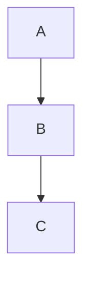

Parsing the Principia
=====================

*An introduction to coding EBNF-grammars and building parsers for logical formulae.*


Introduction
------------

When editing historical text from the fields of mathematics or formal logic, there sometimes arises the question of how to represent formulae that written in a notation that is commonly used, any more. The simplest approach would, of course, to represent the formulae as is and leave the work to figure out the notation to the reader - the only question being whether your typesetting system supports these formulae. 

However, readers might appreciate if the formulae are (also) presented in modern notation. And if you think of digital editions it might ultimately be desirable to translate the historical formulae in a machine readable format so that they can be processed by arbitrary computer systems, most notably proof assistants or computer algebra systems. 

In the following I will show, how this can be done with logical formulae in the Russel-Peano notation which enjoyed widespread use in the first half of the 20th century and was used among others by philosophers like Bertrand Russell, Rudolf Carnap or Willard van Ornam Quine. It was the notation that Russell's and Whitehead's Principia Mathematica was written in, one of the most fundamental works in mathematical logic in the early 20th century. 

This demonstration also serves as an introduction to building parsers on the basis of formal grammars - a topic well known to students of computer science, but, unfortunately not so much in the field of Digital Humanities. This is unfortunate, because formal grammars are a powerful tool that can be used for data extraction and transformation as well as for developing gentle domain specific notations that are way more comfortable to use than, say XML. 

If you have ever heard of regular expressions, as I trust most Digital Humanists have, you can think of formal grammars as the next step beyond and a more powerful version of regular expressions. So keep on reading.


Part 1: A primer on formal grammars
-----------------------------------


### Building a parser for Arithmetic Formulae

Before we dive in the the Russell-Peano notation, which I expect only few people to know, let's start with a notation that everybody knows already from school, namely, that of simple numeric formulae like:

    2 + 4 * 3
    49 : (8 - 1)

You'll notice that we already use a computerized version of these formulae, where instead of using a centered dot for multiplication, we type an asterisk `*`. The simple reason for this is that the central dot is nowhere to be found on the keyboard. (It could be copy and pasted from a Unicode table but that would be rather laborious if you had to do it all the time. On a computer you would usually
also type `/` instead of the colon `:`, but we'll leave the colon `:` here, for the time being.)


#### Abstract syntax trees of arithmetic formulae

What we need, if we want to make the formulae machine-readable is a parser that reads those formulae and a converter that turns them into a data-structure that is directly processable by the computer and which is called the "syntax tree" of the formula. You might actually also remember this from school, though probably under a different name. In German schools this is called "Termgliederung". (Let me at this point express my gratitude to my math teacher from school, Dr. Frederich, who has taught me this and many other beautiful things about mathematics.) Now, what does the "Termgliederung" of these two formulae look like (I hope, you appreciate a bit of ascii art):

    2 + 4 * 3
    |   \.  /
    |     *
    |    /
    \   /
      +

```mermaid
graph BT
    plus["+"] 
    times["*"]

    %% Invisible subgraph for alignment
    subgraph topRow[ ]
        direction LR
        two["2"]
        four["4"]
        three["3"]
    end
    class topRow noBox

    plus --> two
    plus --> times
    times --> four
    times --> three

    classDef noBox fill=transparent,stroke=transparent;
```

    49 : (8 - 1)
     |    \   /
     |      -
     |     /
     |    /
     \   /
       :



As you can can see, the "Termgliederung" looks like an upside down tree. In this case it is even a binary tree, but this is merely reflects the contingent fact that all relations that we deal with in this trivial example, i.e. `+`, `-`, `*`, `:`, are binary relations. Generally speaking, the syntactical structure of any formula is tree-structure that consists of "nodes" and "branches" and where every node can have an arbitrary number "children", a "child" being a node that is directly connected via a branch to its "parent" node. (You can think of a "node" as a point where a tree branches out.)

In the above two examples `+`, `*` as well as `:` and `-` as well as all the numbers you see are "nodes". In the first example `+` is the parent of `2` and `*` is the parent of `3` and `4`. `+` is not the direct parent of `4` or `3` but in virtue of the obvious connection between the two we can speak of the `+`being the ancestor of `4` and `3` and the latter being the descendants of `+`. `+` is also the ancestor of `2`. Both the ancestor and the descendant-relation do (by convention) also encompass the children (as "direct" or "immediate descendants") and parents ("direct" or "immediate ancestors"). 

You might notice that there is a different between `+` and `*` on the one hand side and the numbers `2`,  `4` and `3` on the other hand side. While the arithmetical signs have children, the numbers don't. In order to describe this difference which, at times, can become important let's call those nodes that do not have children "leaf nodes" - like the leaves of a tree. You might also notice that the `+` has no parent. There can be only one node in a tree with this property and we call this node the "root" of the tree. This is all but a bit of terminology. Don't feel overwhelmed, we will repeat these terms many times over, later, and they are intuitive enough, aren't they? 

One thing that is noteworthy about the second tree is that the round brackets `(` and `)` are not really part of the tree at all. Neither do they appear the the content of a (leaf) node, nor are they connected (via a branch) to any node. The reason is that in the tree representation, the brackets are not at all needed, anymore. For, the purpose of the brackets was to tell us that we have to calculate "8 - 1" before we do the division. Now, if the formula is cast into a tree, we can tell from the structure in which order we have to calculate our formula. And this order is always from the leaves to the root. This is also the reason why we call these trees "abstract syntax tree", because we abstract from all the details that are only needed for the "serialized" representation of the formula as a sequence of characters, like delimiters, or for readability, like whitespace and, but that will come only later, comments for the human reader.

It is also possible to build a tree representation that still contains all those superfluous details like brackets or whitespace. And this is called the "concrete syntax tree". In fact, when parsing a formula, the concrete syntax tree usually is produced first and the abstract tree will be arrived at only later by simplifying the concrete syntax tree either after the parsing step or, more often, already while parsing.

As a little **exercise**, you might want to draw the abstract tree for a variant of the second formula without the round brackets. Do you see and understand the difference?


#### Representations of abstract syntax trees

In the example, before, we have represented the abtract syntax trees of arithmetic graphically (if only by using ascii-art). However, when dealing with abstract syntax trees in a (software-)development context, it is very useful to also have a "serial" representation of abstract syntax trees in a text-format that is both easy to read for humans *and* machines. One important use case where becomes important to write down syntax trees in a convenient form, are test-cases. And, believe me, you'll write a lot of test cases when developing any non-trivial parser. Thus the need for simple serialized representations of syntax trees. In the following I will briefly present three different forms of representing tree structures.

The serialized tree notation that is probably most well known to digital humanists is, of course, XML. In XML a node is written as a pair of an opening tag and a closing tags both of which are demarked with angle brackets `<` `>`. The content of a node, i.e. all branches and leaves further down the tree, is written between the opening and closing tag. (Mind: not between the angle brackets, because that is the "tag name" or "node name" or "node type", all of which are synonyms, although only "tag name" is XML-terminology proper.). For example `<tag>content</tag>` is a leaf node with the string "content" as its content. The content can be other tags, a string of characters or a mixture of both ("mixed content" in XML-terminology). The latter, however, is not needed for representing syntax trees, because a node either branches out to other nodes or is a "leaf" with string content only. Another feature of XML that is quite useful but not needed for syntax trees are attributes. We won't discuss this here or go into any more depth as there a plenty of good beginner's tutorial's for XML on the web. A good starting point is the [w3schools XML tutorial](https://www.w3schools.com/xml/). There exists a [formal specification of XML](https://www.w3.org/TR/2006/REC-xml11-20060816/) with all the details including a full EBNF grammar of XML by the w3c. (You'll learn below what an "EBNF grammar" is.)

Written in XML, the syntax tree of the two trivial arithmetic formulae above looks like this:

    <plus>
      <num>2</num>
      <mul>
        <num>4</num>
        <num>3</num>
      </mul>
    </plus>

    <div>
      <num>49</num>
      <minus>
        <num>8</num>
        <num>1</num>
      </minus>
    </div>

If this looks rather clumsy to you, you are absolutely right. This is due to XML being a rather verbose format that works best when you have a lot of text with a few tags in between, but not so well if you want to encode data, where, naturally, every item is surrounded by tags. There are much more elegant ways to write down tree-structures. For example, one could simply write them as indented text like this:

    plus
      num "2"
      mul
        num "4"
        num "3"

    div
      num "49"
      minus
        num "8"
        num "1"

This is about as compact as it gets, except that it is not possible to write short tree structures on a single line as could be done with XML. There exists, however, a venerable old notation for tree structures that allows to write trees in a non-verbose manner either on a single line or in multiple lines. This notation is called S-expression. (S-expressions are well known to anyone who has ever used any of the Lisp-family of computer languages. In Lisp-family languages one directly writes down the program as an abstract syntax tree which makes developing macros or self-altering programs much easier.) The S-expression notation for the two arithmetic formulae above looks like this:

    (plus 
      (num "2") 
      (mul 
        (num "4") 
        (num "3")))  

or, as a one-liner: `(plus (num "2") (mul (num "4") (num "3")))`. The most concise possible form would be: `(+ 2 (* 4 3))`

    (div 
      (num "49") 
      (minus 
        (num "8") 
        (num "1")))

or, as a one-liner: `(div (num "49") (minus (num "8") (num "1")))`. The most concise possible form would be: `(: 49 (- 8 1))`

The only downside of S-expression is that you need to keep track of all the opened parantheses. However, modern editors help by highlighting the matching parantheses if you use the Lisp or Scheme mode. In the following, I will mostly use S-expressions for the syntax trees.

There are, of course, may other alternatives to representing tree structural serially in text-form. In the web-development world and for Javascript/TypedScript-based projects the (JSON)[https://www.json.org/json-en.html]-based [unist](https://github.com/syntax-tree/unist) might be a good alternative. However, they are a bit less (human-)readable than S-expressions, so we will stick to those. 


#### A grammar for arithmetic formulae

Now that we know where would like to arrive at, we can start to think about developing a parser for arithmetic formulae that reads a formula and produces a syntax tree. We will do so by defining a formal grammar for arithmetic formulae. The nice thing about formal grammars is that they can be used to automatically generate a parser from the grammar that is able to digest any formula or, more generally, any "text" that adheres to the rules of the grammar. The program that generates a parser from a grammar is called a "parser generator".

Now, in order to specify the formal grammar of a formal language, you need another formal language, namely that of the formal grammars themselves. A common standard for formal grammars is the EBNF (Extended Backus-Naur Form)-language. 

There are different variants of EBNF, but usually they only differ with respect to which signs they use for definitions (e.g. `::=` or `=` or `<--`), or other elements and whether lines end with a semicolon ´;` or not, and how "terminal symbols" (i.e. parts of the language that are not composed of other parts like the numbers in our case) are written. We will stick to the [EBNF-variant](https://dhparser.readthedocs.io/en/latest/Reference.html#ebnf-reference) that [DHParser](https://gitlab.lrz.de/badw-it/DHParser) uses.

The basic elements that EBNF consists of are:

1. 

